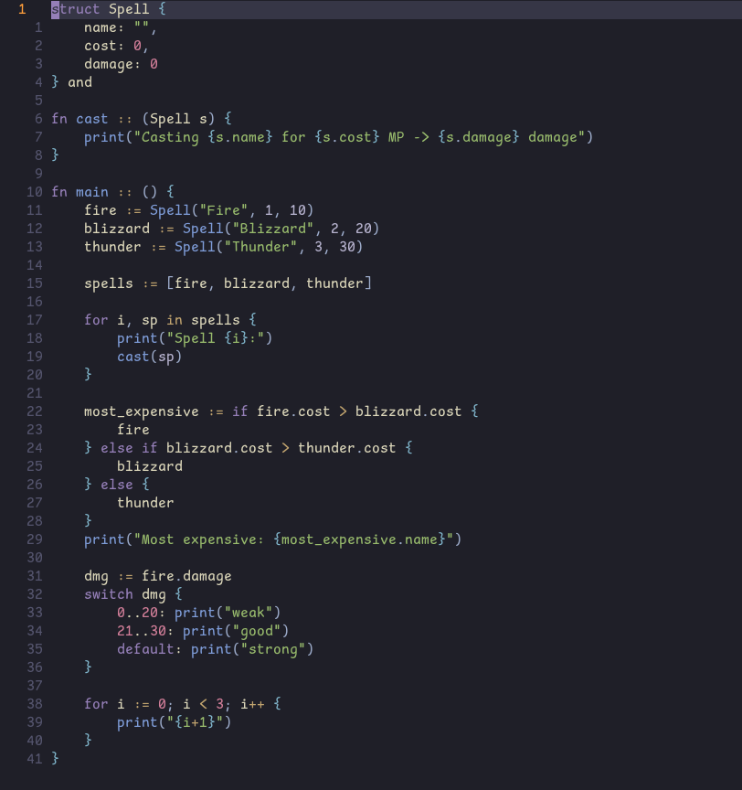

# tree-sitter-vivi

A **[Vivi](https://github.com/maidnaut/Vivi/blob/main/docs/spec.txt) grammar** for the
**[tree-sitter](https://github.com/tree-sitter/tree-sitter) parsing library**.

## Screenshot



## Nvim highlighting
move `queries/highlights.scm` to `$HOME/.config/nvim/queries/vivi/highlights.scm`

nvim config
```lua
vim.api.nvim_create_autocmd('User', { pattern = 'TSUpdate',
callback = function()
  require('nvim-treesitter.parsers').vivi = {
    install_info = {
      url = 'https://github.com/jkylander/tree-sitter-vivi',
      --revision = HEAD, -- commit hash for revision to check out; HEAD if missing
      -- optional entries:
      --branch = 'develop', -- only needed if different from default branch
      --location = 'src', -- only needed if the parser is in subdirectory of a "monorepo"
      generate = false, -- only needed if repo does not contain pre-generated `src/parser.c`
      generate_from_json = false, -- only needed if repo does not contain `src/grammar.json` either
      queries = 'queries', -- also install queries from given directory
    },
  }
end})

vim.filetype.add({
  extension = {
    vivi = 'vivi',
  }
})

vim.api.nvim_create_autocmd('FileType', {
  pattern = 'vivi',
  callback = function(args)
    vim.treesitter.start(args.buf, 'vivi')
  end,
})
```

## Local setup

Install `tree-sitter-cli`:

```bash
cargo install tree-sitter-cli
```

To generate bindings:

```bash
tree-sitter generate
```

To run tests:

```bash
tree-sitter test
```

